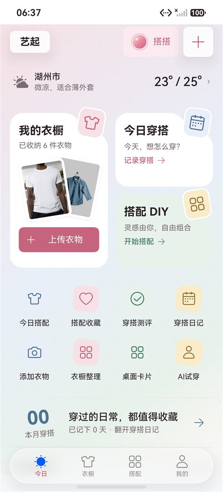
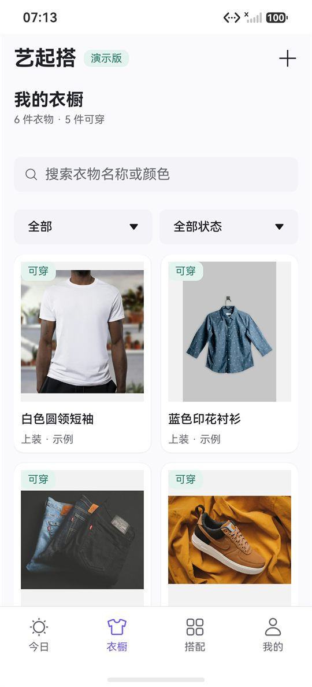
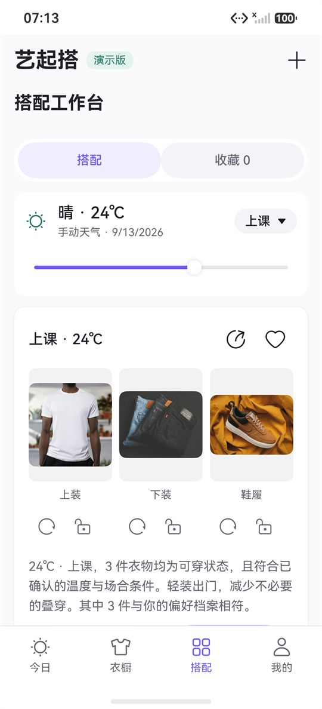
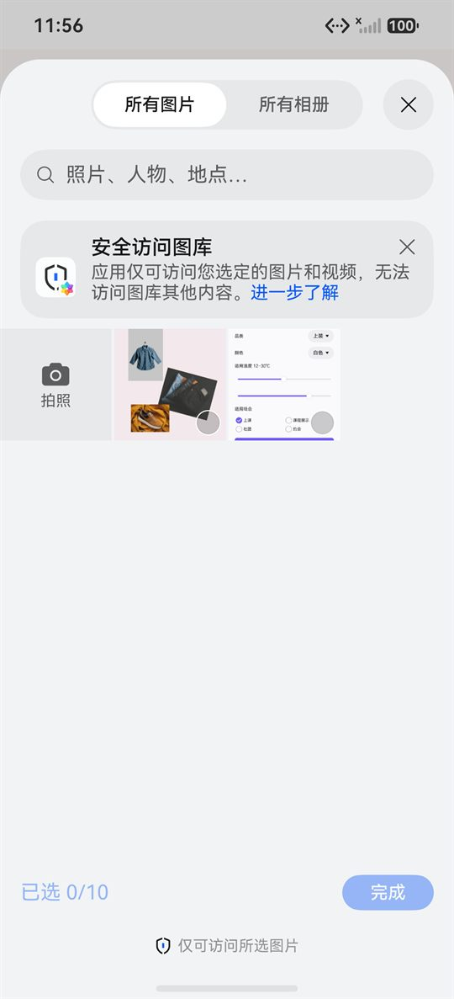
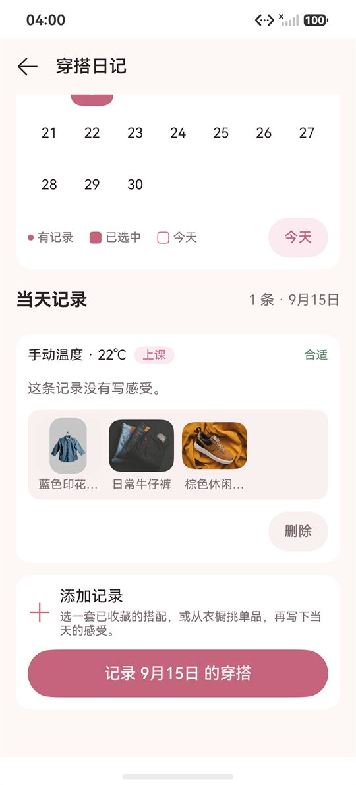
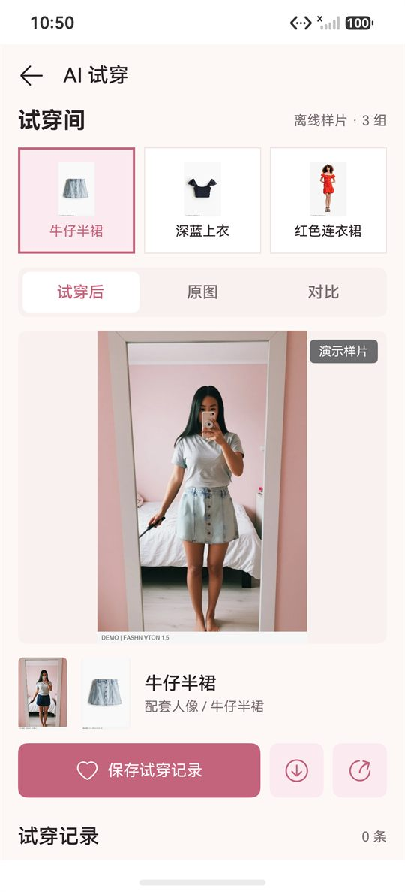
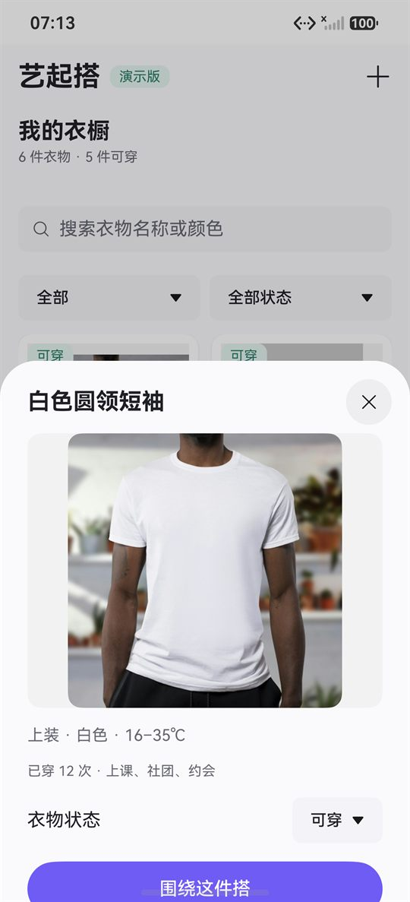
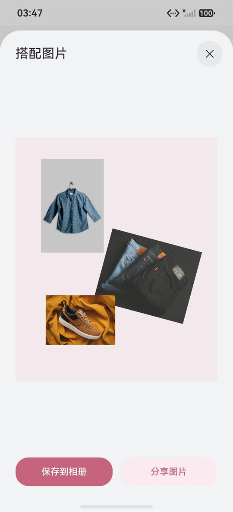
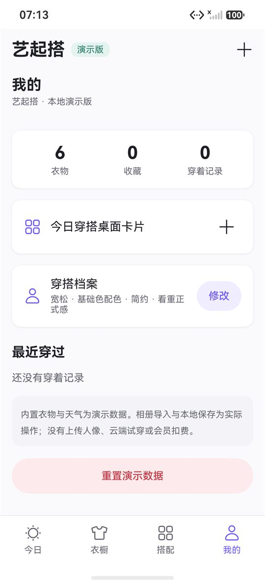

# 艺起搭 · Yi_Da

面向鸿蒙高校创新赛的**原生数字衣橱与穿搭推荐**演示应用。使用 ArkTS / ArkUI 与 Stage 模型，
`targetSdkVersion` 与 `compatibleSdkVersion` 均为 **HarmonyOS API 26.0.0**（HarmonyOS 7），设备类型 `phone`、`tablet`。

选衣服这件事，用已有的衣服就能解决大部分问题：把衣橱录进来，按当天的温度与场合给出**可解释、可替换**的搭配；
想上身看效果时，用固定的离线样片演示试穿流程。推荐是透明的本地规则，不是云端大模型；
衣橱、收藏、日记与偏好全部保存在本机，不上传服务器。

<p align="center">
  
  
  
</p>

<p align="center">
  
  
  
</p>

<p align="center">
  
  
  
</p>

> 以上截图取自鸿蒙 7 模拟器（Pura 90 Pro，API 26.0.0 Release，`127.0.0.1:5555`）的实际运行画面。
> 试穿页展示的是**打包好的第三方演示样片**（FASHN VTON 1.5，Apache-2.0），
> 不是本应用现场生成的结果，页面上也保留了 `DEMO / FASHN VTON 1.5` 标注。
> 截图在入库前缩放到 540px 宽并转为 JPEG（原图见 `artifacts/`，由脚本重新生成，不入库）。

## 目录

- [当前范围](#当前范围)
- [构建](#构建)
- [已运行检查](#已运行检查)
- [三分钟演示路径](#三分钟演示路径)
- [代码结构](#代码结构)
- [分工与协作](#分工与协作)
- [数据、隐私与素材许可](#数据隐私与素材许可)
- [已知限制](#已知限制)

## 当前范围

| 功能 | 当前实现 |
| --- | --- |
| 今日 | 天气条（真实天气取不到时退回手动温度并说明来源）、衣橱入口、今日穿搭与搭配 DIY 小卡、八宫格快捷入口、今日推荐、最近日记 |
| 搭搭助手 | 各页顶栏统一光团入口，按当前页面提供推荐、图片建议、样片演示或操作引导；连续追问只更新候选，点击“采用这套”后先落盘再发布当前搭配 |
| 衣橱 | 搜索、品类与状态筛选、季节/标签检索、详情、五种状态切换（可穿/待洗/收纳/季节隐藏/已归档）、多选批量修改、单件“多推荐/少推荐/中性”反馈、紧凑与舒适两档视图 |
| 批量录入 | 可从系统相册选图，也可直接选择 3 张随包示例照片；同一次录入最多 10 张，逐件确认名称/品类/颜色/适穿温度/场合；可运行随包 MindSpore Lite MobileNetV2 ImageNet 模型给出少量可映射衣物类别候选，并分析图片像素主色，均由用户决定是否采用；可搜索 70 多种细类并手填材质；失败可重试或跳过 |
| 搭配工作台 | DIY 自由画布：拖动、缩放、旋转、调整层级、撤销重做、选择底色，最多 8 件；方案命名保存后可回到原画布继续编辑 |
| 搭配详情 | 单件替换、锁定与排除、收藏、记录穿着、进入画布、导出与分享 |
| 穿搭日记 | 佩戴日历（可翻月、标记有记录日期）、当天记录、从搭配或单品添加、文字与感受；同日同组合去重，删除会撤销计数 |
| AI 试穿（离线演示） | 三组配套素材，搭搭播放约六秒的四阶段交互过程；支持取消、重播、原图对比、保存记录、导出相册与系统分享；全程固定显示“固定离线样片 · 非实时生成”，侧面和背面暂无图片并禁用 |
| 我的 | 会员体验剩余天数、衣橱完善度进度、穿搭档案与身材色彩档案入口、试穿记录、桌面卡片管理、手动离线迁移 |
| 穿搭偏好测验 | 6 道题、可多选、可跳过、可修改；档案只调整推荐顺序，不排除衣物 |
| 推荐 | 本地规则生成最多 3 套不同候选，先按状态/温度/场合过滤，再按单件反馈、偏好、体型信息与穿着次数排序；已采用的其它合法组合仍保留为当前选择；首页支持收藏和记录已穿 |
| 导出与分享 | 搭配画布导出 PNG、保存到系统相册、原生 Share Kit 分享文字清单 |
| 桌面卡片 | FormExtensionAbility、LiveFormExtensionAbility、点击展开直达应用；API 26 摇一摇配置 |
| 沉浸光感 | 卡片与浮层使用 `uiMaterial.ImmersiveMaterial` + `systemMaterial()`，带光感交互反馈；模拟器实测材质等级 EXQUISITE |
| 系统适配 | 字号走 `sys.float.ohos_id_text_size_*`，跟随系统字体大小且上限 1.75 倍；网格 `repeat(auto-fit, 150)` 自动增列，页面限宽 840vp |
| 本地保存 | 有界 JSON 快照、顺序写入、临时文件 + fsync + 原子替换；旧快照缺字段补默认值而不是丢弃数据 |
| 端侧图像分析 | 用户主动点击后，在设备本地加载 `mobilenetv2.ms`；只把模型高置信候选映射到现有五大类，低置信度与不支持类别留给人工确认；失败回到像素主色与手填 |
| 手动迁移 | 系统文件选择器导出/导入衣橱快照及私有衣物图片；导入校验后确认覆盖，成功落盘才发布，失败清理本次图片 |

内置图片与服装属性均为示例数据，应用内显示「示例衣橱」，不代表用户真实拥有。端侧模型是 MindSpore Lite ImageNet 通用分类器，只映射少量衣物标签，不等于专用服装分类模型；结果必须由用户确认。图片像素分析提供主色建议，细类和材质仍由用户选择或填写。没有云端视觉识别。三组试穿图仍是固定离线样片，不会根据用户人像生成。手动迁移需用户传递文件；离线同步状态机当前不代表自动多设备同步；进行中的导入/试穿任务不跨设备续接。支付也未接入。

## 构建

本轮构建使用 `D:\DevEco Studio 2\DevEco Studio`，内置 SDK 为 `26.0.0.105 Release`。脚本也支持传入其它安装目录。

设备目标以 SDK 的 `hdc list targets` 实际输出为准。本轮 Pura 90 Pro 的目标是 `127.0.0.1:5555`，此前也有使用 `127.0.0.1:10000` 的实例；不要把端口写成所有环境必须遵守的固定值。设备脚本自动查找本机的两种已用 SDK 路径，也可通过 `YIDA_HDC_PATH` 指定 `hdc.exe`。

```powershell
.\scripts\build.ps1 -DevEcoHome 'D:\DevEco Studio 2\DevEco Studio'
```

其他安装目录：

```powershell
.\scripts\build.ps1 -DevEcoHome 'D:\Your DevEco Studio'
```

产物：`entry/build/default/outputs/default/entry-default-unsigned.hap`。

当前 `signingConfigs` 为空，因此这个 HAP **未签名，不能视为可直接安装到手机的最终包**。在 DevEco Studio 打开本工程，连接鸿蒙 7 手机并开启 USB 调试，在工程签名设置中完成设备签名，再通过 Run 安装。账号登录与设备授权由设备持有人完成，项目不保存账号密码。

## 已运行检查

```powershell
node scripts/check-domain.cjs          # 127 项，包含 Index、天气与试穿过程接线
node scripts/check-index.cjs           # 52 项（已包含在 check-domain 中）
node scripts/check-weather.cjs         # 4 项（已包含在 check-domain 中）
node scripts/check-presentation.cjs    # 11 项（已包含在 check-domain 中）
node scripts/check-ai.cjs              # 16 项，含静态 Kit 图片颜色接线
node scripts/check-agent.cjs           # 4 项，助手意图与真实推荐接线
node scripts/check-sync.cjs            # 9 项
node scripts/check-migration.cjs       # 7 项
node scripts/check-migration-host.cjs  # 5 项
```

- **业务检查 127 项**：含真实 `Index` 接线 52 项、天气 4 项、试穿过程 11 项，覆盖候选不改快照、采用先落盘后发布、失败重试、天气交错、过期建议、六秒时序与生命周期取消。
- **专项检查 41 项**：图片与端侧识别 16、助手意图 4、同步 9、迁移包 7、Picker 宿主 5。与业务检查合计 168 项；没有重复累加已包含的页面或过程检查。
- 检查直接转译并执行项目的 `.ets` 业务源文件，**不替代** ArkUI、系统 API 或真机测试。
- 若本机没有 `node_modules/typescript`，可传入 DevEco 自带的 `typescript` 路径作为第一个参数。

界面抓取脚本，用于核对演示路径上的实际可见文本与可点击位置：

```powershell
.\scripts\dump-ui.ps1                  # 当前页面的文本与可点击元素
.\scripts\dump-ui.ps1 -ClickableOnly   # 只看可点击元素
.\scripts\capture-demo.ps1             # 按演示路径自动抓取截图到 artifacts\demo
.\scripts\capture-dada-tryon.ps1       # 在试穿页拍五张实际阶段截图并记录拍摄时间，不保存记录
```

`capture-demo.ps1` 会真实操作应用：温度通过在滑块上点击并读取滑块自身数值来确认，控件位置全部从实时布局读取，每一步都校验预期文本，失败即报错而不是产出错图。

关于坐标：`uitest dumpLayout` 给出窗口坐标，`uiInput` 用屏幕坐标。本机实测两者一致（偏移 0），脚本仍保留失败后回退到另一种原点的逻辑，换设备时不会静默错位。

脚本保持纯 ASCII：本机 PowerShell 5.1 按 ANSI 代码页读取 `.ps1`，中文字面量（含注释与正则）会被错误解码并导致语法错误。中文标签用 `[char]` 码点写出，读取设备数据文件时显式指定 UTF-8。

### 鸿蒙 7 虚拟机实测（API 26.0.0 Release，127.0.0.1:5555）

以下是此前版本在本机虚拟机逐条操作的历史记录，操作方式是 `uitest dumpLayout` 读取真实布局。2026-09-24 仅新增的随包示例照片录入入口做了模拟器预览检查；定位、主色分析、体型推荐和手动迁移没有进行设备回归，统一设备验收清单见 `docs/DEVELOPMENT_STATUS.md`。

| 项目 | 实测结果 |
| --- | --- |
| 安装与启动 | `hdc install -r` 成功，四个入口与底部导航正常渲染 |
| 衣橱列表与滚动 | 6 件示例衣物全部可见，网格滚动正常 |
| 状态影响推荐 | 上装改为待洗后今日推荐由 2 套降为 1 套；改为季节隐藏后衣橱计数由 5 件可穿降为 4 件可穿 |
| 温度边界 | 15℃ 自动加入外套并说明原因；5℃ 给出“缺少可穿的上装”，不虚构搭配 |
| 单件替换与锁定 | 上装可替换为另一件；锁定后再次替换提示先解锁 |
| 收藏与穿后反馈 | 可收藏、取消收藏并记录感受，重启后恢复 |
| 批量录入页 | 独立路由正常进入，系统相册与随包示例照片入口可见；**取消选图后回到空状态，不产生空衣物、不显示失败、不遗留任务** |
| 相册选择器 | 系统 PhotoPicker 正常拉起，选择上限显示为「已选 0/10」，与容量规则一致 |
| 随包示例照片 | 三张衣物照片可见；点选衬衫后独立 PNG 成功进入待确认预览，退出未保存项后原有 7 件衣物保持不变。设备上的最终保存与重启尚未验证 |
| 系统分享 | 打开原生分享面板并显示当前搭配清单，可取消 |
| 桌面卡片 | 普通卡片添加成功，温度改为 15℃ 后卡片同步显示 4 件单品 |
| 卡片直达 | 冷启动与热启动带 `fromCard` 都落在“今日”，不再停在上次页签 |
| 重置演示数据 | 弹窗写明影响范围，确认后收藏由 1 变 0、记录清空并提示已恢复；快照文件保持原时间戳未被误重置 |
| 穿搭偏好测验 | 6 道题可逐题作答、可跳过、可回上一题；完成后结果页展示 6 个可修改维度，档案写入本机快照并在“我的”显示摘要 |
| 偏好影响推荐 | 选择“宽松 / 低饱和 / 学院”后，蓝色印花衬衫排到前面，推荐理由追加“其中 1 件与你的偏好档案相符” |
| AI 试穿（离线样片） | 三组样片可切换，试穿后/原图/对比三种视图正常，保存记录后重启仍可打开，导出相册与系统分享实际可用，记录可确认删除 |
| 系统字号 | 字号改用 `sys.float.ohos_id_text_size_*`，并在 `AppScope` 声明跟随系统字体大小、上限 1.75 倍 |
| 大屏自适应 | 衣物网格用 `repeat(auto-fit, 150)` 自动增列，页面限宽 840vp，平板与折叠屏展开后不会拉成一条 |

`artifacts/demo/`、`artifacts/app/`、`artifacts/tryon-demo/` 下是按演示路径自动抓取的实拍截图（该目录不入库，可由脚本重新生成）。

### 自动化能覆盖到哪一步

- 可以自动完成：温度切换、四个页签、单品详情、偏好测验、批量录入页、随包示例照片选择和预览。系统 PhotoPicker 的复选框也已用 `uitest` 点选成功，见 `docs/DEVELOPMENT_STATUS.md` 的 2026-09-18 修正记录。
- 随包图片不在系统图库中；录入页的「示例照片」入口直接从应用资源复制到沙箱，不会伪装成系统相册照片。`hdc file send` 到 `/data/local/tmp` 的图片不会被图库收录。透明通道与 EXIF 方向、导入后 DIY/导出的完整流程和真机抠图仍需单独验收。
- 滑块两端点击与多选复选框的自动点击在虚拟机上间歇失效，这两处同样以人工操作确认。
- 业务规则本身由纯检查覆盖，不依赖界面自动化。

下图是系统 PhotoPicker 的选择界面；后续已确认可通过复选框选择图片。

<p align="center">
  
</p>

### 本轮新增与修掉的问题

- 批量录入：新增 `GarmentImport` 状态机、`GarmentImportRunner`（唯一状态所有者 + 串行导入链）、`GarmentImportController`（页面接线）与 `SnapshotCommit`（先落盘 → 再发布 → 后处理延后项），保存语义改为“落盘成功才移交图片所有权并计入已保存”。
- 修掉两个真实缺陷：串行推进用只增不减的下标，导致**复制失败重试实际不会重新复制**；保存失败时控制器只记提示、未把任务置为 `ERROR(SAVE)`。
- 单件换图改为使用**不可复用的文件标识**（会话 + 单调计数器），修掉“取消一次再换一次会取到同一个文件名、覆盖上一张未保存图片”的问题。
- 启动遗留清理增加门禁：清理结束前不建立新的导入文件；卡片唤起在导入流程中走统一退出保护，不会丢下未完成的任务。
- **崩溃修复**：Weather Service Kit 与 Location Kit 属于 HMS 侧共享包，本机模拟器没有该包，静态 `import` 会让进程直接 abort（`load hsp failed, hsp name:com.huawei.hms.weather/WeatherService`，表现为一启动就退回桌面）。改为运行时 `try/catch` 动态加载，拿不到就退回手动温度。
- 偏好测验切题时题干显示上一题：`@Builder` 分支里直接写 `QUIZ[step].title` 会被 ArkUI 复用实例，已拆成独立 `@Builder` 重新求值。
- 旧快照缺少新字段（日记、试穿任务、会员、身材档案、方案名称）会补默认值而不是丢数据。
- `scripts/build.ps1` 把 hvigor 的 stderr 警告当成终止错误：已限定只按退出码判断构建结果。
- `scripts/dump-ui.ps1` 复用设备文件名，短内容覆盖长文件时读到上一次的残尾：改为每次用新文件名。
- `scripts/check-index.cjs` 的 AST 探针在 TypeScript 下解析不了 ArkTS 的 `struct`：解析前把 `struct X` 归一化为等长 `class X`，行列号不变。

## 三分钟演示路径

以下步骤记录此前版本的鸿蒙 7 虚拟机演示路径；2026-09-24 新增能力尚未做设备回归，现场使用前需按 `docs/DEVELOPMENT_STATUS.md` 统一验收。

1. 打开“今日”，说明示例衣橱与手动天气，查看 24℃、上课场景的两套建议（上装按穿着次数较少优先，先给蓝色印花衬衫）。
2. 点击单品下的替换按钮，仅替换上装；锁定上装后再次替换，展示“这件衣物已锁定，请先解锁”。
3. 在“衣橱”把当前上装改为待洗，返回今日，可选项由 2 套降为 1 套；改为季节隐藏时，衣橱头部由 5 件可穿降为 4 件可穿。
4. 把温度调到 15℃，推荐自动加入外套并说明“加入外套应对偏凉天气”；再把黑色短款皮夹克设为收纳，页面给出“15℃、上课场景缺少可穿的外套”。
5. 把温度拉回 5℃，展示“缺少可穿的上装”，说明缺件时不会虚构搭配。
6. 恢复可穿状态和 24℃，收藏搭配，点击“今天穿这套”并记录感受。
7. 点顶部「＋」进入**批量录入**：直接选一张随包示例照片，确认名称、品类、颜色、适穿温度与场合后保存；回衣橱查看新增单品。现场有自己的照片时，也可走同页的系统相册入口一次选择多张。
8. 在“我的—穿搭档案”做一次偏好测验（约 6 题，可跳过），完成后展示 6 个可修改维度；回到“今日”，推荐理由会说明有几件与档案相符，蓝色印花衬衫排到前面。
9. 进入「搭配 DIY」拖动、缩放、旋转几件单品，保存方案并导出 PNG；也可从首页「AI试穿」进入试穿间，切换三组离线样片并保存试穿记录。
10. 点击分享图标打开系统分享面板，可直接取消。
11. 在“我的”添加“今日穿搭”桌面卡片，回桌面查看；点温度或状态后卡片内容同步刷新，点击卡片图片从“查看搭配”返回应用时会直接落在“今日”。

第 11 步的互动卡片展开动效与摇一摇需要真实手机：虚拟机返回错误码 801 且没有传感器，不能在验证前标注为现场演示已通过。没有第二台设备，本版不将跨设备流转列为完成能力。

## 代码结构

```
entry/src/main/ets/
├── pages/                    页面与弹层
│   ├── Index.ets             入口：四入口页签、独立页路由、唯一状态所有者、快照提交
│   ├── GarmentImportPage.ets 批量录入：缩略图队列、逐件表单、固定提交区
│   ├── HomePage.ets / WardrobePage.ets / OutfitStudioPage.ets
│   ├── OutfitDetailPage.ets / DiaryPage.ets / TryOnPage.ets
│   ├── ProfilePage.ets / AddGarmentSheet.ets / CityPicker.ets
├── service/                  业务与平台能力
│   ├── GarmentImport.ets           录入状态机、校验、稳定 ID 规则
│   ├── GarmentImportRunner.ets     录入会话：items/index 唯一所有者 + 串行导入链
│   ├── GarmentImportController.ets 页面接线：提交顺序、局部候选快照、退出清理
│   ├── SnapshotCommit.ets          提交锁：先落盘 → 再发布 → 后处理延后项
│   ├── DemoRepository.ets          相册导入、多选、原子保存、受限遗留清理
│   ├── OutfitEngine.ets            可解释推荐、偏好排序与替换
│   ├── OutfitCanvas.ets            画布归一化与编辑历史
│   ├── OutfitExport.ets            导出 PNG、保存相册、系统分享
│   ├── GarmentCutout.ets           主体抠图能力检测与串行互斥
│   ├── WearHistory.ets             穿着记录：新增、去重、删除撤销计数
│   ├── WeatherService.ets          运行时动态加载，取不到退回手动温度
│   ├── TemperatureAdvice.ets       温度与降水提示
│   ├── TryOnDemo.ets               离线试穿场景与记录契约
│   └── TryOnDemoMedia.ets          场景 ID 到打包资源的映射
├── model/                    Wardrobe（快照契约）、GarmentImport（队列类型）
├── components/               Theme（设计令牌）、MaterialKit、HomeBackdrop
├── data/                     DemoData（示例衣橱）
└── widget/                   桌面卡片与共享展示数据
```

| 路径 | 用途 |
| --- | --- |
| `scripts/check-domain.cjs` | 127 项业务检查，直接转译生产 `.ets` 源文件 |
| `scripts/check-index.cjs` | 52 项页面探针，AST 与生产 `Index.ets` 同一份实现 |
| `scripts/check-presentation.cjs` | 11 项真实控制器、页面命令与同组素材导出检查 |
| `scripts/check-recognition-image.cjs` | 3 项静态 Kit 图片读取与资源释放检查，已计入识别检查 |
| `scripts/build.ps1` | 命令行构建（不改 SDK、包名与签名配置） |
| `scripts/dump-ui.ps1` | 读取设备当前界面，核对可见文本与可点击位置 |
| `scripts/capture-demo.ps1` | 按演示路径自动抓图 |
| `scripts/device-lib.ps1` | 设备操作与布局读取的公共函数 |
| `scripts/prepare-tryon-assets.py` | 由官方样片拼图裁剪出试穿演示素材 |
| `scripts/export-readme-images.ps1` | 把 `artifacts/` 的实拍截图缩放导出为 `docs/images/`（README 用图） |
| `docs/DEVELOPMENT_STATUS.md` | 各阶段进度、验证结果与**未验证项** |
| `docs/DESIGN_NOTES.md` | 配色、布局、沉浸光感、动画与联调手记 |
| `docs/TRYON_DEMO.md` | 试穿演示的代码边界与素材来源 |
| `docs/DADA_DEMO_HANDOFF.md` | 搭搭拍摄路径、真实能力边界、包与截图交接说明 |
| `docs/ASSETS.md` | 内置示例衣物图片来源（Unsplash） |
| `docs/COMPETITION_PLAN.md` | 竞品参考、鸿蒙能力与排期 |
| `docs/images/` | README 截图（由 `artifacts/` 缩放导出，入库以便协作者直接查看） |

## 分工与协作

当前协作者范围与建议分工（可按实际调整）：

| 方向 | 主要文件 | 说明 |
| --- | --- | --- |
| 页面与交互 | `pages/*.ets`、`components/` | 布局、动画、系统字号与大屏适配 |
| 业务与数据 | `service/*.ets`、`model/` | 推荐规则、录入状态机、快照提交与一致性 |
| 测试与验收 | `scripts/check-*.cjs` | 扩充纯检查项；界面验收记录写入 `docs/DEVELOPMENT_STATUS.md` |
| 文档与素材 | `docs/`、`resources/` | 演示脚本、素材许可与来源登记 |

改动约定：

- **提交信息**用中文，遵循 Conventional Commits：`feat(scope): …` / `fix(scope): …` / `docs:` / `test:` / `chore:`。
- 业务逻辑改动**必须同时补或改检查项**；`node scripts/check-domain.cjs` 与 `node scripts/check-index.cjs` 全绿才提交。
- 检查直接转译生产 `.ets` 文件，**不要在测试里复制一份算法**。
- 文本文件用 UTF-8 保存；PowerShell 脚本保持纯 ASCII（原因见上文）。
- 不修改 SDK 版本、包名、签名配置与依赖锁文件；不提交 `build/`、`.hvigor/`、`oh_modules/` 与 `artifacts/`。
- 界面结论只写实际跑过的：跑不动就写“未验证”，不要写成通过。

## 数据、隐私与素材许可

- 衣橱、收藏、日记、偏好与试穿记录**全部保存在应用沙箱**（`wardrobe_demo_v1.json`），不向服务器发送。相册选择走系统 PhotoPicker 的免权限接口；只有用户主动点击“使用当前位置”时，应用才申请前台粗略定位权限，用于天气查询。
- 内置示例衣物照片来自 Unsplash（许可：<https://unsplash.com/license>），逐张标识见 `docs/ASSETS.md`；仅作为示例衣物，不代表用户真实拥有，也不对图片中的品牌作背书。
- 试穿演示样片来自 **FASHN AI 的 FASHN VTON 1.5** 官方展示拼图（Apache-2.0），裁剪与标注改动说明见 `entry/src/main/resources/rawfile/tryon_demo_notice.txt`，原始许可证随包提供。样片是**预计算的第三方演示素材，不是本应用现场生成的结果**。
- 试穿记录保留 `DEMO / FASHN VTON 1.5` 标记，任意衣橱单品不会被映射为这三组固定结果。

## 已知限制

- **未签名**：`signingConfigs` 为空，产物是未签名 HAP，不能直接装到手机；真机安装需自行配置签名。
- **试穿不是真实生成**：没有接入生成服务，只演示固定样片；真实接入时结果写入 `resultUris`，不改变历史 `demoSceneId` 的含义。
- **抠图依赖设备能力**：本机模拟器不提供 `SystemCapability.AI.Vision.SubjectSegmentation`，只验证了降级路径（保留原图）。
- **仅手机尺寸验证过**：平板与折叠屏的大屏列数已用 `repeat(auto-fit)` 与限宽实现，但只在手机尺寸模拟器上确认过；深色模式、1.75 倍字号排版、安全区与分享目标的真机行为待验证。
- **互动卡片与摇一摇需要真机**：虚拟机返回错误码 `801`（当前设备能力不支持），未跑通。
- **批量录入的界面验收未完成**：PhotoPicker 无法用 `hdc`/`uitest` 自动点选（详见上文），逐件录入、失败重试、透明通道与 EXIF 方向等项需人工在设备上验收。
- 上限：衣橱 100 件、收藏 50 套、穿着记录最近 100 条。
- 云端同步、真实 AI 识别与三姿势生成、支付、自动多设备流转尚未接入；当前仅支持用户主动的离线迁移。

构建工具仍会提示部分文件 API 可能抛异常，错误由调用侧捕获并显示保存/加载失败状态。
