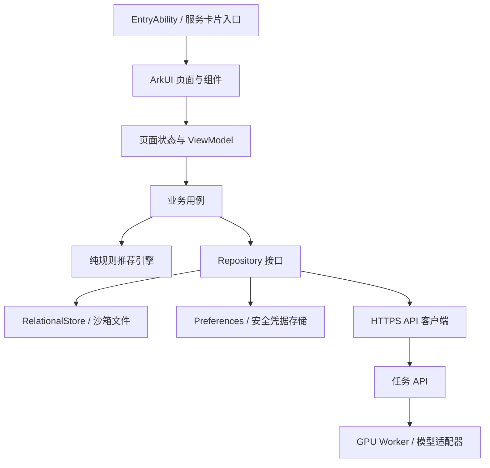

# 艺搭完整开发文档

版本：v1.0 开发基线\
日期：2026-09-05\
目标：HarmonyOS 7；本工程 API 基线 `26.0.0`\
适用阶段：从现有空白 Stage 模板开发可运行的参赛 MVP

> 本文是根据项目调研 PDF、现有工程及技术资料制定的实施设计，不是功能已经实现的声明。标为“约定”的内容是本项目的工程决策；标为“待验证”的内容必须经过实验或真机验收。文档不替代赛事规则、服务条款或许可证审查。

> 2026-09-05 实施补记：本轮已在原 Stage 工程实现 M1 本地核心并进行 API 26 构建/模拟器测试，见 [实施验证](verification/M0-M1-2026-09-05.md)。本文“当前工程事实”表保留开发基线编写时快照，实际完成状态以任务清单和该证据为准，不将后续设计当作已实现。

## 目录

1. 产品目标与首版范围
2. 现有工程与开发环境
3. 用户故事与需求编号
4. 信息架构与页面规格
5. 交互、视觉与无障碍
6. 应用架构与工程组织
7. 数据模型与本地持久化
8. 衣物导入与管理
9. 推荐引擎
10. 人物模板与三姿势试穿
11. 网络与任务生命周期
12. AI 服务端与部署
13. 鸿蒙特色能力
14. 安全、授权与数据删除
15. 测试、性能与可观测性
16. 分阶段开发路线
17. 发布与决赛演示
18. 风险及替代方案
19. 研发规范与变更管理
20. 开发启动检查

配套文件：[接口契约](接口契约.md)、[数据库 DDL](database/schema.sql)、[任务及验收](开发任务与验收清单.md)、[来源与待验证项](技术来源与待验证项.md)。

## 1. 产品目标与首版范围

### 1.1 产品定义

艺搭把用户已经拥有的衣服，变成可执行、可调整、可看见的穿搭方案。

核心任务有两层：

```text
基础闭环：
添加衣物 -> 确认属性与状态 -> 指定单品/场景 -> 推荐
-> 换一件 -> 保存方案 -> 记录已穿/反馈

创新闭环：
确认方案 -> 选择可试穿单品 -> 同一人物三张姿势照
-> 明确上传授权 -> 云端三次静态试穿 -> 结果对比/保存
```

首版不要求用户录入完整衣柜，不要求身体测量数据，不强制创建账号才能使用本地功能。样例衣橱可在首次进入时主动选择，和个人衣橱分开标识。

### 1.2 核心用户

第一阶段以学生和初职场用户为测试对象，优先解决上课、答辩、面试、通勤、周末出行的穿搭选择。年龄不是过滤规则，不实施基于外貌或身体类型的强制分类。

### 1.3 首版 P0

| 编号 | 范围 | 最低完成标准 |
| --- | --- | --- |
| FR-01 | 衣物录入 | 样例、相册、相机；质量提示；AI 建议可纠错；支持纯手工录入 |
| FR-02 | 衣橱管理 | 图片、详情、搜索、筛选、五种状态、批量编辑、归档及恢复 |
| FR-03 | 可控推荐 | 只使用本衣橱候选；锁定单品；硬约束；理由；单件替换；保存 |
| FR-04 | 穿着记录 | 记录已穿及简单负反馈；离线保存；不要求复杂学习系统 |
| FR-05 | 人物模板 | 同一人三张标准姿势照；检查及确认；上传前授权 |
| FR-06 | 静态试穿 | 首版限定一种服装品类，三张独立结果；原图对照及单图放大 |
| FR-07 | 可靠任务 | 上传、排队、生成、失败、取消；部分成功；重试；重启恢复 |
| FR-08 | 结果管理 | AI 标识、保存与系统分享、输入一致的透明备用结果 |
| FR-09 | 鸿蒙入口 | 首选服务卡片直达真实业务；若实验不通过，在 M0 重新选定一条链路 |
| FR-10 | 隐私与删除 | 本地优先、逐次上传确认、删除入口、密钥保护、模型署名 |

P0 表示必须具备此用户能力，不表示所有实现方式都要一次完成。例如，FR-01 的 AI 分类可在端侧和获授权的云服务中择一验证；识别不可用时仍须允许手工保存，但仅有手工录入不能被表述成“AI 识别已完成”。

### 1.4 可选范围

| 优先级 | 功能 | 前置条件 |
| --- | --- | --- |
| P1 | 一衣三搭故事板 | 推荐引擎与服装缩略图稳定 |
| P1 | 手机与平板结果查看 | 两台目标设备、明确的授权与传输实现 |
| P1 | 相机姿势轮廓引导 | 实际拍摄与模型输入质量测试 |
| P1 | 系统分享接收 | URI 授权、类型检查、导入队列已完成 |
| P1 | 小艺意图 | 应用内主任务已可运行；确认开放条件 |
| P1 | 场景海报 | 先用固定模板排版，不增加第二个生成模型 |
| P2 | 穿搭日历、行李、统计 | 基础闭环与任务稳定后 |
| P2 | 家庭衣橱、完整账号、穿戴端 | 单独立项和重新评估 |

本轮明确不做：BMI 健康建议、强制五体型标签、购物交易、公开社区、实时 AR、视频换装、3D 试衣、尺码精确预测、布料仿真。

### 1.5 成功定义

- 产品价值：用户可用少量真实单品得到一套可穿方案，并替换其中一件。
- 展示价值：固定授权样例完成至少一次真实云端三姿势生成；能看懂输入与结果的对应。
- 鸿蒙价值：至少一个真机系统入口与真实业务连接，不是截图或伪按钮。
- 可靠性：失败有原因、有可操作出口，不以无限加载掩盖错误。
- 透明性：历史、备用和模拟数据始终可区分。

PDF 中“三分钟首个成功时刻”及“十轮至少九轮通过”是目标，不是已经测得的性能或模型成功率。

## 2. 现有工程与开发环境

### 2.1 当前工程事实

| 项目 | 2026-09-05 实际读取结果 | 开发影响 |
| --- | --- | --- |
| 工程 | `Yi_Da`，单 `entry` 模块 | 在现有模板上增量开发，不另建替代工程 |
| 应用模型 | `stageMode`，`EntryAbility` | 继续使用 Stage |
| 包名 | `com.chr.Yi_Da` | 暂不更改；签名及控制台登记前确认最终标识 |
| SDK 配置 | target/compatible 均为 `26.0.0` | 当前没有低版本支持承诺 |
| 编译版本 | 未显式填写 `compileSdkVersion` | 核对实际 IDE 构建解析结果，不盲改模板 |
| 构建模型 | 根包和 Hvigor 的 modelVersion 为 `26.0.0` | 配套工具必须能处理此模型 |
| 设备 | `phone` | 平板必须另行配置、构建及真机测试 |
| 首页 | `Index.ets` 的 Hello World | 产品页面未实现 |
| 签名 | 空 signingConfigs，产品引用 default | 安装前补齐实际签名配置 |
| 备份 | `allowToBackupRestore: true` | 人像、任务及凭据加入前审查 |
| 测试依赖 | Hypium `1.0.25`、Hamock `1.0.0` | 先沿用模板，不凭空升级版本 |
| Git | 当前属于上级仓库，项目目录尚未跟踪 | 不擅自 init、提交父目录或推送 |

### 2.2 官方版本与本机环境

本次通过华为官方版本概览正文核对：API `26.0.0 Release`、HarmonyOS SDK `26.0.0 Release` 对应 DevEco Studio `26.0.0.821`，发布时间为 2026-08-29。官方说明从 API `26.0.0` 起采用 `X.Y.Z` 格式。[S01][S02]

因此本文保留用户使用的“HarmonyOS 7”产品称呼，但工程与设备能力讨论以 `26.0.0` 为精确基线，不能将 SDK 字段填写为 `7`。

本机在 `D:\DevEco Studio` 读取到的版本仍为 `6.1.0.860`，其内置 SDK 为 HarmonyOS `6.1.0` / API `23`。这只证明该路径的安装版本，不排除电脑还有另一套 IDE。当前工程中的 `26.0.0` 也不能证明正在使用的 IDE 已升级。

### 2.3 M0 环境门槛

1. 在实际打开项目的 IDE 中读取 About DevEco Studio 和 About HarmonyOS SDK，记录版本。
2. 使用配套 IDE 完成 Sync；依赖锁文件由工具生成并纳入版本控制。
3. 对当前模板执行 Debug 构建，保存完整构建结果；不要同时加入业务代码。
4. 通过 IDE 配置签名，验证目标手机安装、启动、返回桌面、再次进入。
5. 记录手机型号、ROM、API、屏幕尺寸及可用的测试平板。
6. 确认测试服务端的域名、HTTPS、网络可达性和演示 GPU 资源。
7. 调整业务备份策略前先明确数据范围，严禁把访问令牌放进可备份配置。

本文不提供猜测的 Hvigor 绝对路径或声称已执行的构建命令。M0 从实际 IDE 成功构建日志中记录可复现的命令行调用，再加入项目脚本。

## 3. 用户故事与需求编号

| 场景 | 用户操作 | 系统必须做的事 | 不允许的结果 |
| --- | --- | --- | --- |
| 首次使用 | 选择体验样例 | 建立独立样例数据，展示示例标记 | 将样例算作本人衣物 |
| 添加衣服 | 多选 5 张照片 | 逐张处理、可纠错、成功项可保留 | 一张失败导致全部重来 |
| 准备答辩 | 锁定一件衬衫 | 补齐其他必需类别并给理由 | 偷换锁定单品 |
| 衣服待洗 | 批量设置待洗 | 下次推荐立即排除 | 只改图标、不改候选 |
| 不喜欢裤子 | 换一件 | 保留其他单品，重验全套约束 | 重新随机生成整套 |
| 没有合适鞋子 | 请求完整搭配 | 显示缺少类别，可添加或改条件 | 从不存在的商品补齐 |
| 上传人像 | 查看本次上传清单 | 单独确认，只上传已选素材 | 默认上传整个人物图库 |
| 一张试穿失败 | 点击失败项重试 | 创建可追踪的新任务，复用成功结果 | 丢失其他两张图 |
| 任务中离开 | 返回应用 | 恢复服务端状态 | 把任务当作新请求重复生成 |
| 云服务超时 | 主动打开备用 | 校验输入指纹并显示生成时间 | 自动换成不对应的图片 |
| 删除人像 | 选择删除关联数据 | 清除本地并提交云删除，显示进度 | 只删缩略图却称“全部删除” |

## 4. 信息架构与页面规格

### 4.1 页面树

```text
MainShell
  TodayPage
    OutfitDetailPage
  WardrobePage
    ImportQueuePage
    GarmentEditPage
    GarmentDetailPage
    ArchivedGarmentsPage
  OutfitStudioPage
    OutfitDetailPage
    TryOnSetupPage
      PersonTemplatePage
      PoseCapturePage
      TryOnTaskPage
        TryOnResultPage
          ResultViewerPage
  ProfilePage
    PreferencesPage
    PrivacyDataPage
    GenerationHistoryPage
    ModelCreditsPage
    DevicePage (P1)
```

四个底部入口保留各自筛选与滚动位置。详情和任务页通过统一导航栈进入；返回退出当前子页，不清空整个衣橱状态。

### 4.2 页面字段与行为

| 页面 | 必须展示 | 主操作 | 空、加载、错误状态 |
| --- | --- | --- | --- |
| 今日 | 城市或手动温度、场景、真实服装组合、两条理由 | 换一件、围绕这件搭、记录已穿、试穿 | 无衣物时导入/样例；天气不可用时手动温度 |
| 衣橱 | 图片网格、分类/季节/状态筛选、搜索 | 添加、多选、批量编辑、详情 | 无筛选结果可清筛选；图片损坏仍能编辑属性 |
| 导入队列 | 每张缩略图、处理状态、需确认字段 | 重试单张、跳过、保存已确认项 | 权限拒绝切相册/手工；识别失败不阻断保存 |
| 衣物编辑 | 名称、类别、颜色、季节、状态；高级属性可折叠 | 保存、取消 | 必填字段就地提示；返回有未保存改动时确认 |
| 单品详情 | 原图/净图、属性、状态、关联搭配 | 围绕这件搭、编辑、归档 | 已归档显示恢复；永久删除单独确认 |
| 搭配工作台 | 场景、温度、风格、锁定项、候选方案 | 生成、替换、锁定、保存 | 约束冲突解释具体字段；不暗中放宽硬约束 |
| 搭配详情 | 单品清单、推荐理由、历史快照有效性 | 调整、已穿、生成试穿 | 单品已不可用时标记并要求重新确认 |
| 试穿设置 | 三张人物照、目标衣物、替换范围、上传用途 | 检查素材、确认生成 | 缺图、格式错误、未授权、品类不支持分别处理 |
| 任务页 | 上传/排队/单姿势状态、已完成图片 | 取消、离开页面、查看已完成图 | 断网显示连接状态，不伪报任务失败 |
| 结果页 | 三图、原图对比、AI 标识、时间、来源 | 放大、保存、分享、重试失败项 | 部分完成显示失败原因；缓存标注备用 |
| 我的 | 偏好、授权、数据管理、历史、署名 | 修改、清理、撤回云功能授权 | 云删除未完成必须持续显示 |

### 4.3 路由与载荷

路由使用稳定页面名以及 `garmentId`、`outfitId`、`localJobId` 等短 ID，不传 Bitmap、大图片 Base64 或访问令牌。详情页通过 Repository 重新读取数据。

外部卡片/意图参数按不可信输入处理：只允许白名单动作，检查 ID 是否存在且属于当前本地空间。外部入口不得跳过人物上传确认。

### 4.4 原始素材与历史快照

“查看过去的搭配”和“今天再穿一次”是不同操作。过去方案展示保存时快照；再次推荐、已穿确认或发起试穿前必须检查当前衣物是否存在且可用。若历史图片因用户永久删除而失效，保留文字占位，不暗中恢复已删除素材。

## 5. 交互、视觉与无障碍

### 5.1 设计方向

这是日常使用的衣橱工具，不是营销落地页。首屏突出真实衣物与当前任务，减少大号统计和装饰块。推荐采用中性浅底、清晰文字与少量绿色操作色，错误和警告另用语义色；最终配色通过真机对比度检查后冻结。

- 服装图使用统一背景和稳定比例，主体完整，不以纯色块替代真实单品。
- 衣橱缩略图建议 1:1；人物输入和试穿结果以 3:4 竖图为默认呈现比例。
- 不把不同尺寸原图强拉伸；预览按完整内容显示，模型输入按独立标准化流程处理。
- 图标优先使用项目验证可用的系统符号资源；找不到时用有授权的图标资源，不假设 Web 图标库可直接导入 ArkTS。
- 可编辑数值用输入/步进，状态用选项控件，筛选用选择器，避免把所有控件做成文字胶囊。
- 所有图片操作有可访问名称；选中、异常及状态不能只依赖颜色表达。

### 5.2 布局约定

以下为项目设计断点，不宣称是固定系统规则：

| 可用窗口宽度 | 布局 |
| --- | --- |
| 小于 600vp | 四入口底部导航；衣橱 2 列为起点；结果逐图滑动并保留三图缩略入口 |
| 600-839vp | 衣橱增加列数；详情可使用双区域；验证折叠屏窗口变化 |
| 不小于 840vp | 导航侧栏、列表与详情；三姿势并列显示 |

按窗口可用宽度而非设备型号判断布局；分屏、键盘、系统栏、横竖屏变化后重新测量。字号不随视口宽度连续缩放。支持系统字体放大，长衣物名称换行或省略并在详情提供完整文字。

### 5.3 关键状态文案

| 场景 | 建议文案 |
| --- | --- |
| 无候选 | 当前衣橱没有符合条件的鞋履 |
| 季节信息未知 | 请确认这件衣物适用的季节 |
| 人像上传 | 本次将上传 3 张人物照片和 1 张衣物照片 |
| 限定试穿范围 | 本次仅替换上装，下装与鞋履保留人物原图 |
| 实时任务 | 正在生成侧身效果 |
| 连接中断 | 暂时无法获取进度，任务可能仍在继续 |
| 备用显示 | 最近成功结果（备用） |
| AI 结果 | AI 生成，仅供视觉穿搭参考 |
| 云删除待执行 | 本地已删除，云端删除待联网完成 |

不显示伪造进度百分比。能取得确定的已上传字节数时可显示上传百分比；模型无步数回调时只显示真实阶段及已完成张数。

## 6. 应用架构与工程组织

### 6.1 分层



页面不直接调用数据库、HTTP 或模型。ViewModel 不持有长期存活的页面上下文和图片像素对象。业务层输入输出使用明确类型，方便离线单元测试。

首版只使用一个 Entry HAP，在模块内部按目录分层。出现明确的多模块复用需求后再提取 HAR；不为每个页面创建独立 HAP/HSP。

### 6.2 建议目录

以下是未来目录，不代表已生成：

```text
entry/src/main/ets/
  entryability/EntryAbility.ets
  pages/Index.ets
  navigation/
  features/
    today/{pages,viewmodels,components}/
    wardrobe/{pages,viewmodels,components}/
    outfit/{pages,viewmodels,components}/
    tryon/{pages,viewmodels,components}/
    profile/{pages,viewmodels,components}/
  domain/
    models/
    usecases/
    recommendation/
    repositories/
  data/
    database/
    migrations/
    repositories/
    remote/
    mappers/
  platform/
    permissions/
    media/
    files/
    security/
    forms/
  common/
    errors/
    logging/
    config/
    components/
entry/src/test/
entry/src/ohosTest/ets/test/
server/                         # 后续独立服务端，不随 HAP 打包
docs/
```

### 6.3 主要接口职责

| 接口 | 责任 |
| --- | --- |
| `GarmentRepository` | 衣物读写、筛选、状态和批量事务 |
| `OutfitRepository` | 搭配版本、单品快照、穿着记录与反馈 |
| `MediaRepository` | 图片复制、校验、缩略图、文件引用与清理 |
| `RecommendationEngine` | 硬约束、候选排序、解释和替换 |
| `PersonTemplateRepository` | 三姿势素材、本地授权关联 |
| `TryOnRepository` | 本地任务、服务端映射、结果持久化 |
| `TryOnService` | 上传、创建、查询、取消、重试及删除请求 |
| `ConsentService` | 授权版本、本次上传确认、撤回处理 |
| `CapabilityService` | 平台及云能力检查、失败原因与降级 |
| `Clock` / `IdGenerator` | 可注入时间和 ID，保证测试可复现 |

这些是项目抽象名称，不是鸿蒙系统 API。

### 6.4 状态管理与生命周期

新增页面优先在目标 SDK 上验证 ArkUI 状态管理 V2，再统一使用；迁移当前模板的 V1 装饰器时按组件完成，不在同一字段混用两套响应式机制。[S03]

页面状态区分 `initial/loading/content/empty/error`；任务业务状态独立保存。推荐参数、筛选、未提交编辑草稿、任务 ID 具有不同生命周期，不合并成全局可变对象。

应用前台恢复流程：

1. 打开本地数据库，处理未完成迁移及待恢复媒体记录。
2. 从本地读取未终结任务及待删除项。
3. 网络与凭据有效时，查询服务端状态；不自动重新创建任务。
4. 按服务端修订号应用更新，忽略更旧的响应。
5. 用户主动进入结果页后下载未缓存结果。

## 7. 数据模型与本地持久化

### 7.1 存储分工

本项目约定关系数据使用 `RelationalStore`，轻量设置使用 `Preferences`，图片存于应用私有目录，数据库保存相对文件引用。[S04]

本轮实际衣物库支持无图手工记录：`image_asset_id` 可空，另设 `thumbnail_asset_id`；试穿输入仍必须具有已校验照片。v1 迁移由 `scripts/generate_schema.py` 从参考 SQL 生成 `rawfile/database/v1.json`，避免维护两份不同 DDL。ArkData 写连接外键与读连接差异、同连接事务及清理时机的实测修正见实施验证；Preferences 与云任务恢复本轮尚未实现。

Preferences：主题、默认城市、温度偏好、是否体验过样例、最后一个 Tab。访问令牌及刷新凭据不存 Preferences，也不放入 SQL。

核心表及字段定义见 [schema.sql](database/schema.sql)。DDL 是参考基线，是否已在目标设备上执行须看验收记录，不能用桌面 SQLite 测试代替 ArkData 测试。

### 7.2 实体

| 实体 | 关键内容 | 生命周期 |
| --- | --- | --- |
| `media_asset` | 类型、相对路径、SHA-256、格式、宽高、字节数、云 ID | 通过引用及删除策略管理 |
| `garment` | 所属空间、名称、类别、颜色、季节位图、状态、版本 | 归档可恢复；永久删除不可恢复 |
| `garment_tag` | 单品标签，多对多的轻量展开 | 随单品删除 |
| `outfit` / `outfit_item` | 场景、温度、算法版本、理由、单品快照、锁定信息 | 保留历史语义 |
| `wear_log` | 本地日期、场景、关联方案、备注 | 与保存搭配区分 |
| `outfit_feedback` | 冷热、喜好、原因、对应单品可为空 | 输入后续排序 |
| `person_template` / `person_pose` | 模板名、三姿势照片、质量确认版本 | 默认本地，随用户删除 |
| `consent_receipt` | 授权文本版本、用途、选中图片摘要、确认及撤回时间 | 不保存原始人像 |
| `tryon_job` / `tryon_pose` | 本地/云状态、输入快照、指纹、三图结果、来源 | 任务可跨进程恢复 |
| `deletion_outbox` | 云删除请求、幂等键、阶段和重试时间 | 获得服务端清理确认后结案 |

首版不实现多人共享衣橱。`space` 区分 `personal` 和 `demo`，推荐默认不跨空间。

### 7.3 枚举与约束

| 字段 | v1 允许值或规则 |
| --- | --- |
| 衣物状态 | `wearable/laundry/stored/season_hidden/archived` |
| 衣物类别 | `top/outerwear/bottom/dress/shoes/accessory` |
| 季节位图 | 春=1、夏=2、秋=4、冬=8；组合按位或；0=未知 |
| 温度 | 摄氏度；最低不大于最高；允许未知，不伪造默认适温 |
| 场景 | `campus/defense/commute/interview/weekend`；扩展需同步规则 |
| 穿着版型偏好 | 可选，不以身高体重作为必填 |
| 图片 | 本地引用不可直接用作服务端 URL |
| 时间 | 本地数据库 UTC 毫秒整数；接口 RFC3339 UTC；穿着日独立保存本地日期 |
| ID | 应用生成随机 UUID；服务端 ID 视为不透明字符串 |
| 更新 | 实体 `version` 乐观锁；任务使用服务端 `revision` |

季节是用户选定或由城市规则得到的业务上下文，不能仅按月份假定全球气候。温度与适用季节冲突时提示用户调整，不静默忽略。

### 7.4 事务、迁移与文件一致性

- 数据库访问统一入口，启用并验证外键约束；批量状态编辑必须为事务。
- 衣物图片先写临时路径，校验后原子重命名，再写媒体与衣物事务；崩溃留下的孤立文件由启动清理扫描处理。
- 不使用 `CREATE TABLE IF NOT EXISTS` 代替迁移。新增列、数据回填、索引修改应有单独迁移编号。
- 以数据库版本控制升级；每次迁移先事务执行，失败保留原数据并展示可恢复错误，不直接清库重建。
- 修改衣物属性增加 `version`；搭配快照不随之被重写。
- 永久删除单品前，清理历史 JSON 快照中的本地路径及远端图片标识；可以保留不含图片的名称/类别摘要。
- 文件清理由引用关系、删除请求共同决定；删库记录与删文件不具备同一事务，需要可重试的清理流程。

### 7.5 归档与永久删除

归档仅将状态改为 `archived`，可在归档页恢复为用户指定状态。批量永久删除必须二次确认。

永久删除涉及仍在使用的图片时，不自动破坏其他有效对象：先显示关联影响，用户确认级联删除或拒绝操作。删除人物模板应同时处理相关生成任务、输出和缓存；云端部分通过删除队列追踪。已导出到相册或第三方应用的副本无法由应用保证远程清除。

## 8. 衣物导入与管理

### 8.1 导入流水线

```text
Picker / Camera / Share(P1)
-> 验证读取授权与媒体类型
-> 复制到沙箱暂存
-> 读取方向并规范化、去除定位等非必要 EXIF
-> 限制解码像素、尺寸与文件体积
-> 生成缩略图
-> 主体分割与属性建议（可失败）
-> 低置信度确认 / 手动编辑
-> 持久化衣物和媒体
```

工程默认单次最多导入 20 张，逐项维护状态，最多 2 个图片处理工作并行；这些是初始配置，按目标机内存测试调整，不是平台上限。

### 8.2 属性确认

必填：名称、类别、图片来源、衣物状态。颜色和季节允许未知，但未知关键属性的衣物不能被无提示当作完全满足推荐条件。

AI 输出保存来源、模型版本、字段置信度和用户是否修改；置信度阈值仅作为待标定参数，不把“0.9”自动解释成实测 90% 准确率。

`top` 与 `outerwear` 独立呈现，识别容易混淆时明确让用户确认。风格、场景、检索标签不互相替代。

### 8.3 失败与重复

- 没有相机权限：允许 Picker、样例和手工录入；拒绝定位不阻断推荐。
- 分割失败：保留原图，允许裁剪或重试；不得保存透明空图。
- 分类失败：直接进入人工确认，不丢弃图片。
- 处理取消：保留已保存单品，未保存暂存文件按 TTL 清理。
- 重复判断：首版仅做相同规范化文件 SHA-256 提示；视觉近似去重属于 P2。
- 批量保存：每件独立提交并显示成功/失败清单；同一次批量修改已有衣物则使用全有或全无事务。

### 8.4 媒体安全默认值

接收图片解码后不超过 24MP，单张上传文件不超过 10MiB，只允许 JPEG/PNG，限制宽高最大 8192px；全批次限制由客户端能力响应给出。检查真实文件头和解码结果，不信任扩展名或 MIME 声明。

服装本地原图、净图和用于上传的标准化图分别有用途标记。严禁遍历整个相册为云端自动建库。

## 9. 推荐引擎

### 9.1 v1 方法

采用“硬约束过滤 + 有界候选搜索 + 可解释排序”。第一阶段不依赖云端大模型生成衣物 ID，避免产生用户没有的衣服。

输入：

```text
space
scene
temperatureMinC / temperatureMaxC
seasonMask
lockedGarmentIds
excludedGarmentIds
optionalStylePreferences
recentWearLogs / feedback
algorithmVersion
```

输出：最多 3 套完整方案、逐条解释代码及参数、候选不足原因、使用的规则版本。

### 9.2 硬约束

1. 与当前空间一致，状态必须为 `wearable`。
2. 排除用户本次明确不想穿的单品。
3. 类别槽位合法，不把裙装和必选上下装模板同时强行叠加。
4. 适用季节、温度、场景满足用户已确认规则。
5. 锁定单品必须保留；若本身冲突，返回冲突原因，不替用户解除锁定。
6. 不出现重复 ID，不把同一衣服同时当内搭和外套。
7. 必填信息未知时进入“需确认”候选集合，不作为已经满足所有硬约束的正式方案。

场景着装规则应是用户可确认的偏好模板，例如“面试时排除运动鞋”，不是把刻板规则当成所有人的必然要求。

### 9.3 槽位模板

| 模板 | 必需槽位 | 可选槽位 |
| --- | --- | --- |
| 分体搭配 | top、bottom、shoes | outerwear、accessory |
| 连衣裙搭配 | dress、shoes | outerwear、accessory |

按温度和用户确认设置，可以让外套成为本次必需槽位。缺少必需槽位时不给“完整可穿方案”，返回 `MISSING_SLOT` 以及缺失类别。可以展示明确标为“不完整”的草稿，但不能计入成功推荐。

### 9.4 排序示例

初始排序权重作为版本化配置：

```text
score =
  0.30 * colorCompatibility
  + 0.25 * stylePreference
  + 0.15 * materialComfort
  + 0.15 * wardrobeRotation
  + 0.15 * feedbackAffinity
```

各项归一化到 `[0,1]`。没有可靠数据的可选项从本次分母移除并重归一化，不假装已有个人画像。颜色规则先使用可解释的颜色组表，而不是宣称专业审美准确率。

解释必须来源于实际过滤和排序结果，例如：

| 代码 | 文案参数 |
| --- | --- |
| `MATCH_TEMPERATURE` | 温度范围、对应衣物 |
| `MATCH_SCENE` | 本次场景、符合的规则 |
| `KEEP_LOCKED_ITEM` | 锁定单品名称 |
| `NOT_WORN_RECENTLY` | 有真实日志支持的天数 |
| `PREFERENCE_MATCH` | 用户明确选择的偏好 |

没有穿着日志时不能生成“近 30 天未穿”这种伪个性化理由。

### 9.5 搜索复杂度与替换

每个槽位过滤后最多保留 20 个候选，使用宽度 30 的有界搜索组合，输出去重后前 3 套。以上为起始参数，保留版本，压力测试 500 件衣物时记录耗时。

单件替换的实现应固定其余槽位与锁定项，只对目标槽位搜索，再对全套重验硬约束。同分结果按稳定 ID 排序，测试和现场演示不依赖不可控随机。

### 9.6 反馈与天气

首版记录“太冷、太热、不喜欢、不可用”及可选原因。“不可用”须用户确认后才修改衣物状态，不能因为对整套方案点了不喜欢就把衣服移出衣橱。

规则级反馈学习按“场景 + 温度区间 + 相关单品”局部调整，并限制影响幅度；不把一次反馈永久上升为全部场景的结论。

天气提供者通过适配器接入，供应商尚未选定。位置只用于城市选择，天气不是 Location Kit 的直接输出。无服务或过期时显示更新时间并允许手动温度；演示城市天气要明确标为样例，不能伪装实时天气。

## 10. 人物模板与三姿势试穿

### 10.1 首版能力边界

主验证品类暂定 `top`，只接收经验证适合的单件上装。`outerwear`、叠穿、连衣裙和下装必须分别实验，不能因模型文档列有类别就直接承诺支持。

推荐输出可以包含整套衣服，但首版实际试穿只替换目标上装，下装与鞋履保留人物原图；试穿设置、结果及导出说明必须保持一致。未验证整套换装前，不把推荐清单等同于图片已经穿上的全部单品。

三姿势建议从“正面、轻侧身、轻微动作”开始。大幅侧身、复杂手部遮挡与大动作只作为实验，不保证固定“动态抓拍”必然可用。

### 10.2 输入素材标准

- 同一位自愿授权人物的三张不同姿势图片，不自动从单张照片生成新姿势。
- 固定、干净背景，光照均匀，人物主要区域完整，避免多人和明显遮挡。
- 人物当前服装尽量贴近选定模型的可处理范围。
- 服装图主体完整，颜色及关键图案可辨识，背景干净。
- 标准化默认宽 768、高 1024，方向确定后采用保全主体的缩放与留边；不得静默裁掉头脚。
- 自动质量检查只负责可测问题；“同一人物”“已经授权”等由用户明确确认，不额外引入人脸身份库。
- 模型预处理产生 mask、人体解析等中间数据，纳入与原图相同的数据删除范围。

### 10.3 模型验证

报告建议优先实验 CatVTON，IDM-VTON 作为对照。官方 CatVTON README 给出简化推理显存口径，但自动 mask 的应用路径仍涉及人体解析和 DensePose 等组件；不得将它描述为“不需要任何预处理”。[S05][S06]

具体模型、基础权重、预处理、许可证、模型版本和 GPU 配置在 `AI-01` 后冻结。首版不训练基础模型，不直接将公开 Gradio 演示地址当生产 API。

实验矩阵至少包含：

| 维度 | 起始样本 |
| --- | --- |
| 人物 | 1 组授权三姿势 |
| 服装 | 2 件同一支持品类 |
| 结果 | 至少 6 张基础组合，每组重复生成并记录波动 |
| 环境 | 实际 GPU 型号、显存、驱动、精度、输入大小 |
| 记录 | 冷/热模型耗时、单图耗时、三图耗时、峰值显存、失败类型 |
| 人工检查 | 人物可辨识、衣物身份、边界遮挡、姿势差异、明显肢体异常 |

只有上述最小实验通过后，才把模型支持范围写到应用配置中。文献结果、仓库宣传参数、固定样例测试和真实用户效果分别记录。

### 10.4 输入指纹与备用匹配

云端按不可变配方 `recipeId` 解析模型版本及生成参数。创建任务前客户端取得配方，明确每个姿势的种子。`recipeId` 指向不可变配置，服务端不得在原 ID 下偷偷更换模型。

指纹使用服务端规范化 JSON 的 UTF-8 字节求 SHA-256：

```text
fingerprintVersion
space
outfitSnapshotVersion + orderedOutfitItems
targetGarmentContentHash + targetCategory
orderedPoses[poseKey, normalizedPersonContentHash, seed]
recipeId + normalizationVersion
outputWidth + outputHeight
```

规范化规则：固定字段集合和字段顺序；衣物按槽位 ASCII 升序排序，姿势顺序为 `front/side/action`；标识限定 ASCII，整数十进制；不包含本地路径、短效 URL、任务 ID、asset ID 和创建时间。精确字段顺序见接口契约第 4.1 节。服务端提供指纹与规范化版本，客户端按相同算法验证，准备黄金测试向量。

服装名称调整是否改变快照应按版本处理，不能仅凭衣物 ID 匹配旧图。相同内容重新上传得到新 asset ID 不应改变生成输入指纹。

### 10.5 结果来源

每张结果保存 `originJobId`、`generatedAt`、`recipeId`、`seed`、输出 SHA-256。任务来源独立于执行状态：

| 来源 | UI 与导出 |
| --- | --- |
| 本次实时生成 | 显示本次任务及生成时间 |
| 历史记录 | 显示历史结果及时间 |
| 备用缓存 | 持续显示“最近成功结果（备用）” |
| 重试复用 | 单图显示来自前次任务，不能称三张均新生成 |
| 本地模拟 | 仅用于开发，显示“模拟数据”，不计入真实生成 |

AI 标识在结果预览、放大页、保存图片和分享输出中保持。保存时生成用于分享的带标识副本，保留原输出校验值，不因后加文字改变原始推理输入审计。

## 11. 网络与任务生命周期

接口与 JSON 示例以 [接口契约](接口契约.md) 为准。

### 11.1 客户端与服务端状态分离

客户端提交状态：

```text
draft -> validating -> uploading -> submitting -> submitted
                       |              |
                 local_failed    submission_unknown
```

`submission_unknown` 表示请求可能已被接受，须使用原幂等键重查/重发同一请求，不另建新生成。

服务端父任务状态：

```text
queued -> running -> succeeded
                 -> partial_success
                 -> failed
queued/running -> cancelling -> cancelled
```

单姿势状态：`queued/running/succeeded/failed/cancelled`，每次执行的终态不可变。

父任务汇总规则：

1. 已接受取消时，进入取消分支，直到所有尚未提交的姿势停止或被逻辑作废。
2. 未取消且还有执行中项时为 `running`；全部尚未运行时为 `queued`。
3. 所有姿势终结后，3 张成功为 `succeeded`，1-2 张成功为 `partial_success`，0 张成功为 `failed`。
4. `cancelled` 仍可保留取消被接受前已提交的成功图；取消不等于删除。

连接状态、图片下载状态、结果过期和任务执行状态分别表示。轮询超时不允许客户端自行把远端任务标成失败。

### 11.2 创建任务

1. 用户确认本次上传清单及云处理用途。
2. 先落盘本地草稿、授权凭据、幂等键和输入摘要。上传、创建、取消、重试各有独立的操作 ID 和不可变载荷摘要，存入任务操作清单后再发请求；重启后不能重新随机产生这些键。
3. 上传每张图，校验云端 SHA-256 与本地一致。
4. 提交生成请求；收到任务 ID 后立刻事务保存映射。
5. 若响应丢失，用同一键和同一载荷恢复；同键不同载荷为冲突。
6. 前台以建议 2 秒起步、逐步放宽至 5 秒的间隔轮询，服从服务端 `Retry-After`。
7. 成功图逐张下载到暂存、校验、落盘，不等待全部完成才显示。

### 11.3 重试

网络请求重试与重新推理分开：

- GET 可按退避策略重试；429 服从服务端提示。
- POST 创建、取消、重试和删除必须带幂等键，重复网络发送不增加生成次数。
- 失败姿势重试创建一个新父任务，新任务保留 `parentJobId`。
- 未重试的成功姿势引用既有结果与来源时间，新任务具有新的 revision 序列。
- 重试失败姿势默认使用原种子；“效果异常，重新生成”是显式换种子的新任务，因而指纹改变。
- 输入、配方或被复用结果已过期时不盲目重试，要求重新上传/新建任务。

### 11.4 取消与竞态

取消由服务端事务判断。如果所有姿势已完成，返回当前终态，不假称取消成功。若取消先被接受，随后迟到的 worker 结果不得重新发布；写入必须校验取消标志、运行租约和任务版本。

GPU 计算不一定能立即中止；用户看到的是取消请求已受理/已逻辑取消，不是承诺瞬时释放 GPU。失败和取消完成后清理中间文件。

### 11.5 后台与重启

普通前台轮询随页面和应用生命周期停止；不申请不必要的长时后台任务保持轮询。服务器任务继续执行，回前台后查询状态。需要后台通知时单独验证系统能力及通知权限，不作为 P0 的完成前提。

历史结果优先本地读取；远端 URL 过期时重新鉴权获取，不能把短效 URL 当永久图片地址。

## 12. AI 服务端与部署

### 12.1 推荐拓扑

这是首版工程建议，未安装任何服务端依赖：

```text
HarmonyOS App
  -> HTTPS 反向代理
  -> Python API 服务（建议 FastAPI）
       -> PostgreSQL：会话、资产、任务、租约、删除记录
       -> 私有文件卷：输入、mask、输出
  -> 独立 GPU Worker
       -> 模型适配器
       -> 单 GPU 串行执行
  -> 清理 Worker：到期与主动删除
```

初版不引入 Redis、Kubernetes 和多个队列框架。PostgreSQL 任务表作为持久队列，worker 使用行锁领取任务及租约；如果团队已有成熟队列基础设施，可替换内部调度但保持对外契约。

模型环境与 API 环境分离；具体 Python、PyTorch、CUDA 版本按所选模型锁定，不在文档中猜测一组“最新兼容版本”。

### 12.2 服务端模块

| 模块 | 职责 |
| --- | --- |
| sessions | 一次性测试邀请、短效访问令牌、刷新、撤销 |
| assets | 文件解码校验、归属、哈希、TTL、私有下载 |
| jobs | 幂等、配额、输入指纹、父子任务和汇总 |
| workers | 预处理、GPU 推理、心跳、租约和结果发布 |
| recipes | 不可变模型/参数版本及能力发现 |
| deletions | 逻辑封禁、取消关联工作、物理删除、状态查询 |
| telemetry | 不含人像/Token 的事件、耗时、错误和资源指标 |

### 12.3 调度与崩溃恢复

- 一个 GPU 首版仅运行一个推理子任务，不并发装载多个大模型。
- worker 领取任务时产生 `leaseToken`，定期更新心跳；提交输出需验证相同有效租约。
- 租约到期后先核查原执行状态，失联任务可重新入队；同一姿势只允许一次有效提交。
- 采用至少一次执行、幂等提交的设计，不虚假承诺 GPU 推理“恰好一次”。
- 推理输出先写临时目录；成功校验后原子移动并事务登记。
- 磁盘不足、模型未就绪、显存不足分别返回错误，不把所有问题写成网络失败。
- 配置全任务 deadline，队列超时和执行超时独立记录。

### 12.4 默认运行参数

| 参数 | 开发初始值 | 调整条件 |
| --- | --- | --- |
| 用户并行任务 | 1 | 按 GPU 容量实验 |
| 单 GPU 推理并发 | 1 | 验证显存及延迟后再改 |
| 普通 API 超时 | 15 秒 | 网络实测 |
| 单次上传超时 | 60 秒 | 文件上限与网络实测 |
| 整个云任务 deadline | 10 分钟 | 压测后冻结，不作为舞台等待时间 |
| 首次模型加载 | 部署准备阶段完成 | 不能在台上首次下载权重 |
| 输入/结果默认 TTL | 各资产创建后 24 小时 | 上线前审查并与授权文案一致 |
| 单安装日生成额度 | 后台配置，例如 10 个任务 | 测试人数与预算确认 |

以上全部是工程初始值，不是已验证 SLA。`/capabilities` 返回当前限制；客户端不能以远端配置提高超过自身安全上限的媒体解码大小。

### 12.5 部署及运维清单

1. 选定可合法使用的 GPU 与模型，冻结源码 commit、权重 revision 和校验值。
2. 使用隔离环境构建，执行依赖与许可证检查；模型资源不入 HAP 或普通 Git。
3. API 服务与数据库仅开放必要网络路径，公网只暴露 HTTPS API。
4. 数据卷禁止公开目录浏览；不暴露原始 Gradio、调试日志、数据库端口。
5. 配置真实 TLS 证书、服务端密钥、任务限额、上传大小及来源限制。
6. 区分存活与就绪：API 可响应不表示模型已就绪；只有模型加载成功才接受生成。
7. 用非敏感或已授权样例预热，完整走上传、生成、下载、删除。
8. 保留上一版镜像与兼容数据迁移计划，服务回滚不删除用户数据。
9. 上线前演练磁盘满、worker 重启、模型 OOM、证书异常和清理器停止。

## 13. 鸿蒙特色能力

以下为能力选型，不是 API 签名清单。每一项须记录官方接口、since、SysCap、权限、设备、服务开通条件和真机证据。[S07]

| 能力 | v1 用途 | 失败替代 |
| --- | --- | --- |
| Ability Kit / ArkUI | Stage 生命周期、统一导航、自适应界面 | 不存在业务替代，M0 必须验证 |
| ArkData / Core File | 本地实体与私有图片 | 数据层错误可恢复，不直接清库 |
| Media Library / Photo Picker | 用户主动选图 | 手工和样例录入 |
| Camera Kit | 衣物和人物拍照 | Picker |
| Core Vision Kit | 主体分割候选 | 保留原图、人工处理或获授权的云处理 |
| MindSpore Lite Kit | 轻量分类候选 | 人工确认；不运行完整扩散试穿 |
| Network Kit | 云端任务 API | 本地衣橱、规则推荐、已标注备用 |
| Form Kit | 今日方案与直达应用 | 应用内今日入口 |
| Share Kit | 输出系统分享，接收侧为 P1 | 本地保存结果 |
| Location Kit | 可选城市定位 | 手动选择城市与温度 |
| Intents Kit | P1 小艺发起业务意图 | 应用内同一用例 |
| Service Collaboration 等候选 | P1 设备分工 | 手机独立完成主闭环 |

### 13.1 服务卡片 P0 方案

卡片显示一套最近确认的搭配缩略图、场景和更新时间；点击进入搭配详情或今日页。缩略图来源于服装，不默认展示人像。

卡片侧只消费小型可序列化展示快照，不直接跑推荐或 GPU 请求。应用更新搭配后通过正式接口更新卡片，刷新频率及可用交互按 Form Kit 实际限制验证。

卡片不能隐式触发人像上传。卡片未配置、失效或缺图时仍可进入应用。

### 13.2 平板结果查看 P1

先实现手机发起、平板只读查看已授权任务结果，不同时做相机互通、任务接续和双向编辑。

如果使用自有 HTTPS 结果同步，文档和演示必须称“应用级结果同步”，不能冒称已使用 Service Collaboration Kit。真正的鸿蒙协同能力需独立最小实验确认，再替换传输实现。

手机主动创建一次性短时配对码，服务端下发只读任务范围授权；不得在二维码中放永久访问令牌。平板能否下载图片由独立授权确认，撤回后停止新访问。完整同步协议不属于 P0。

### 13.3 意图与系统入口安全

自然语言只映射白名单动作和已存在的衣物 ID；模型解析输出不是执行授权。外部请求发起试穿时必须经过相同输入检查和上传确认。小艺无法联调时不伪装成已接入，保留应用内入口即可。

每日天气/穿搭不接实况窗；暂不为了展示系统能力申请无明确用户任务的权限。

## 14. 安全、授权与数据删除

本章是项目隐私与安全设计要求，不是已经完成的合规结论。

### 14.1 默认策略

- 个人衣橱、本地推荐与手工编辑默认离线可用。
- 不自动上传衣橱，不采集身体测量数据，不引入人脸身份识别。
- 人像用途限定于用户确认的试穿；服务方配置禁止用于训练，不能只在客户端口头承诺。
- 云端只接收本次需要的三张人物标准化图和一张目标衣物图。
- 首版不申请通讯录、麦克风、全量图库或精准后台定位。
- 相机、定位、保存到系统相册等能力按实际调用流程申请最小权限。

### 14.2 鉴权与密钥

本地功能不需要账号。受控比赛测试使用一次性邀请激活独立安装会话，服务端对会话施加配额。它不是公开用户注册体系，不能称作完整账号恢复。

访问/刷新令牌由平台安全存储适配器管理；调研确认可用接口后实现。不得硬编码在源码、HAP、二维码、日志、SQL、Preferences 或卡片数据中。邀请签发密钥和模型供应商 Key 只在服务端。

每个任务、资产、结果和删除请求都校验服务端归属，不接受客户端传入 `ownerId` 作为可信身份。

### 14.3 授权文本最小字段

用途、处理方、上传文件数量和类型、存储地域、保存时长、是否训练、撤回方式、删除范围、生成效果限制。存储地域、处理方尚未确定时不能发布正式云功能。

每次点击生成确认本次素材和用途；长期设置“允许云功能”不替代本次人像上传确认。用户取消授权后立即禁止新上传，并提供删除既有云数据的选项。

### 14.4 保留与删除表

| 数据 | 默认保留 | 删除行为 |
| --- | --- | --- |
| 本地衣物及人物照片 | 用户主动保存后保留至删除 | 处理引用、缩略图、临时副本 |
| 云端输入与中间文件 | 输入资产创建后最多 24 小时 | 到期清理；任务不得跨越资产有效期执行 |
| 云端输出 | 输出创建后最多 24 小时 | 到期删除，可先由用户下载本地 |
| 未提交暂存文件 | 最长 24 小时 | 启动与周期扫描清理 |
| 内容外运行日志 | 初始目标 7 天 | 不保存图片、完整 URL、Token、身体数据 |
| 删除审计 | 仅不含素材的请求 ID、范围摘要、时间与结果 | 保留期限须在上线前确定 |

主动云删除首先逻辑撤销访问并标记所有关联任务不可发布结果，再清理文件、mask、临时目录、缓存和元数据。不能只删原图而保留可识别人物的生成图。

离线删除先清理本地并写入 `deletion_outbox`。再次联网后执行、查询确认；在云端完成前持续显示待处理。用户卸载可能中断本地重试，因此云端 TTL 是额外保障，不依赖客户端持续在线。

### 14.5 备份、导出与恢复

现有模板默认允许备份。M0 暂定在接入人像和会话前关闭该业务的自动备份，或通过正式配置严格排除凭据、人像和云缓存；采用哪种方式须真机验证后记录。

不将用户原图提交到 Git。日志、录屏、答辩素材需要授权和脱敏。用户主动保存到相册或分享出的副本不受应用沙箱删除控制，文案不能宣称可删除所有外部副本。

### 14.6 授权与模型使用

CatVTON 与 IDM-VTON 官方材料载明 CC BY-NC-SA 4.0 的使用条件。[S05][S06] 比赛原型不能自动推定任何展示、发布或后续商业化均获许可；需继续检查基础模型、预处理权重、素材及赛事具体条款。模型署名页列出名称、作者、来源、版本、许可证和修改范围，不将公开模型本身标成团队原创算法。

## 15. 测试、性能与可观测性

### 15.1 测试分层

| 层级 | 内容 | 运行位置 |
| --- | --- | --- |
| 纯逻辑 | 规则、排序、替换、状态汇总、指纹、时间 | Hypium 或抽离后的纯逻辑测试 |
| 数据层 | 外键、事务、迁移、归档、引用和恢复 | ArkData 真机/模拟器；桌面 SQL 只作参考检查 |
| 接口契约 | 鉴权、隔离、幂等、媒体校验、重试、删除 | API 自动测试与受控 GPU 替身 |
| UI | 四入口、返回、空状态、权限拒绝、图片错误 | 目标手机 |
| AI | 固定样例视觉质量、耗时、显存、类别限制 | 实际 GPU |
| 端到端 | 从真实衣橱到真实生成，再保存与删除 | 手机、GPU；平板为独立 P1 集 |
| 稳定性 | 杀进程、断网、服务器重启、低存储 | 真机与测试服务 |

### 15.2 建议质量目标

以下为验收目标，尚未测量：

| 指标 | 目标/口径 |
| --- | --- |
| 固定核心硬约束 | 自动化样例零违规 |
| 锁定与替换 | 锁定项不变；非替换槽位不变 |
| 500 件衣橱推荐 | 在目标手机测 P50/P95；初始 P95 目标 500ms |
| 本地首屏 | 冷启动可交互初始目标 P95 2 秒，需限定机型与数据量 |
| 任务可恢复 | 所有注入失败均可回到可操作状态 |
| 固定演示 | 10 轮至少 9 轮到达三图或明确标注备用出口 |
| 实时生成 | 另报三图真实成功率，缓存不计入 |
| 三图质量 | 固定样例逐张人工检查；不报告未经测量的泛化准确率 |
| 小屏/大字体 | 无按钮遮挡、不可访问操作及关键文案截断 |

完整测试用例和打勾清单见配套文件，首次全部保持未验收状态。

### 15.3 日志与指标

事件包含 `eventName/buildVersion/requestId/localJobId/remoteJobId/phase/durationMs/errorCode` 等最小字段，不含完整人像地址、图片 Base64、Token 或精确位置。

建议事件：

```text
garment_import_started / completed / failed
recommendation_created / no_candidate
outfit_item_replaced / outfit_saved / outfit_worn
tryon_upload_started / job_created / pose_completed / job_terminal
tryon_fallback_opened / job_restored
cloud_deletion_requested / completed / failed
```

初期默认保留本地调试统计，不因建立指标而自动接入第三方埋点 SDK。长期北极星指标为每周实际确认穿着的有效方案数，与点击生成次数区分。

## 16. 分阶段开发路线

### 16.1 顺序与并行边界

默认按一个客户端开发角色、一个可兼任的服务端/模型角色规划。未给出团队人数及截止日，不把以下估算写成既定承诺。

| 阶段 | 内容 | 参考工作量 | 退出门槛 |
| --- | --- | --- | --- |
| M0 | 环境、签名、范围冻结、模型最小实验、Form 试验 | 2-3 人日 | 模板真机运行，模型可行性与能力边界有记录 |
| M1 | 本地数据库、四入口、衣物录入与状态 | 4-6 人日 | 重启后数据不丢，导入/批量管理完成 |
| M2 | 规则推荐、锁定替换、保存、已穿 | 3-4 人日 | 断网完成产品基础闭环 |
| M3 | 服务端、鉴权、上传、三姿势任务与结果 | 5-8 人日 | 至少一次真实三图，完整异常恢复 |
| M4 | 服务卡片、视觉、隐私删除、回归和彩排 | 3-5 人日 | 十轮记录、质量检查、演示包齐全 |
| M5 | 最多 1-2 项 P1 | 单独估算 | 不破坏 P0，并重新跑回归 |

总量约 17-26 人日，未包含未知的能力申请、GPU 获取、设备准备及大规模模型返工；多人并行不等于线性缩短日历时间。

`AI-01` 在 M0 就启动，不能等客户端全部做完再发现模型无法处理目标输入。模型服务与 UI 可按接口契约并行开发；模拟服务全程标注，M3 必须切换真实服务验收。

### 16.2 最早可用版本

第一条开发纵向链路只做：手工/相册添加一件衣物、保存数据库、衣橱显示、杀进程后仍存在。不要首先做复杂首页、完整登录或跨设备同步。

第二条链路做三类必需单品组成一套搭配并替换，之后才加入人物和云生成。

### 16.3 冻结规则

进入最终演示准备期后冻结模型配方、人物组、目标品类和设备链路。新增功能必须说明删减什么等量工作。距离实际答辩不足一周时，原则上只修错误、状态反馈与演示稳定性。

## 17. 发布与决赛演示

### 17.1 交付物

- 可复现的源码版本、依赖锁和构建说明。
- 已签名且目标真机测试过的安装产物，签名私钥不随源码公开。
- 服务端部署说明、配置项说明、固定模型版本及运行健康检查。
- 授权样例素材清单，原图不放公开仓库。
- 真机测试记录、AI 样例质量记录、耗时统计、失败及恢复证据。
- 4 分钟主脚本、屏幕录制、明确标注的备用结果。
- 第三方依赖与模型署名、隐私说明及数据删除操作说明。

确切赛事名称、资格、时间和提交材料仍需用户确认后对照官方规则；本文不自行指定比赛截止日。

### 17.2 主演示

1. 0:00-0:30：从服务卡片进入，说明使用本人已有衣物。
2. 0:30-1:00：锁定一件已验证可试穿的上装，生成答辩搭配并替换一件。
3. 1:00-1:25：展示三张授权人物输入及“本次仅替换上装”，发起真实任务。
4. 1:25-2:20：展示真实阶段，说明端云职责及静态预览边界。
5. 2:20-3:20：查看三图及原图，说明衣物身份与效果限制。
6. 3:20-3:45：保存、故事板或平板查看，只展示已验收链路。
7. 3:45-4:00：总结真实衣橱、可控推荐和视觉结果的闭环。

时间只是脚本安排，实际等待上限按彩排耗时设定。如果模型无法在窗口内完成，主动说明并打开同一输入的备用结果，不以伪进度拖延。

### 17.3 故障顺序

部分失败先展示已成功图片并重试失败项；模型输出明显异常时说明问题并重新生成。网络/GPU 超时由演示者选择备用。系统入口失败则应用内进入，平板失败则手机完成，完全断网则仅演示本地规则及已标识离线结果。

## 18. 风险及替代方案

| 风险 | 早期信号 | 处理 |
| --- | --- | --- |
| IDE 与目标 SDK 不匹配 | Sync、构建模型解析失败 | 先完成 M0，不在旧 SDK 伪造兼容字段 |
| 三姿势质量不足 | 手臂、脸、纹理和侧身失真 | 缩小姿势及品类，换授权输入，记录限制 |
| GPU 不可获得/费用高 | 无稳定实例或耗时不可控 | 先报价与小实验；外部 API 另审授权、成本和隐私 |
| 服务端来不及 | 未实现持久任务和异常恢复 | 缩减 P1，不能用固定图冒充实时服务 |
| 识别误差高 | 类别混淆、背景干扰 | 人工纠错与质量提示优先，模型另迭代 |
| 系统能力受限 | 真机、账号、申请条件不满足 | M0 换成另一条可验证的鸿蒙入口 |
| 云删除不完整 | 临时目录、复用输出仍存在 | 引用图谱与禁止发布标志，专项清理测试 |
| 范围扩大 | 试图同时做社区、购物、全身换装 | 回到 P0 门槛，单独立项 |
| 许可证不满足发布计划 | 仅非商业或衍生分发限制 | 更换已获许可方案，不凭“比赛”豁免 |

## 19. 研发规范与变更管理

### 19.1 代码规范

- 业务类型显式定义，避免页面内临时拼接不受约束 JSON。
- 网络 DTO、数据库行和领域模型分别映射；边界校验失败返回明确错误。
- 不在 UI 线程执行大图片解码、同步文件遍历、复杂组合搜索或长时间推理。
- 异步资源使用完释放；取消请求不代表所有底层工作自动终止。
- 时间、随机数、模型参数和 HTTP 客户端可注入，便于测试。
- 中文注释解释关键业务限制、算法参数、状态竞态和可变策略，不逐行复述语法。
- 可能变更的规则集中配置并注明调整依据、影响范围和对应测试。

### 19.2 Git 与协作

当前项目位于上级仓库中。确定仓库边界前不执行嵌套 `git init`，不暂存旁边其他项目。

新分支默认 `codex/功能名`；提交信息和 PR 说明使用中文，例如 `feat: 实现衣物状态与批量归档`。本轮不自动提交或推送。

密钥、证书、`local.properties`、IDE 缓存、用户照片、GPU 权重和运行日志不提交；锁文件、迁移脚本、测试、资源授权索引应提交。提交前精确查看项目范围的差异。

### 19.3 文档同步

修改品类、姿势、生成参数或授权策略时，同时更新主文档、接口、数据库迁移、测试和演示措辞。需求变化记录决策日期、原因、影响、放弃的替代方案以及验证结果。

需求完成的最低定义：实现代码、异常状态、自动测试或真机证据、文档同步四项齐全，而不是页面可以点击。

## 20. 开发启动检查

开始 M1 前应有以下答案：

- 实际使用的 IDE 与 SDK 是否为配套 `26.0.0`？
- 目标手机能否安装、运行当前工程？
- 服务卡片是否有最小真机验证？如果没有，何时决策替代链路？
- 最终试穿模型、GPU、授权素材与单件品类是否通过最小实验？
- 云服务部署方、地域、费用上限和数据删除责任是否明确？
- 团队人数、实际截止日和可用平板是否已登记？

这些信息尚未全部提供，本文已给出可以先行的本地开发路径和默认范围；未决事项不能被填成“已支持”。

第一步执行 [任务清单](开发任务与验收清单.md) 中的 `ENV-01` 至 `ENV-04`，随后推进 `DB-01` 和 `UI-01`。技术事实及引用编号集中见 [技术来源与待验证项](技术来源与待验证项.md)。
